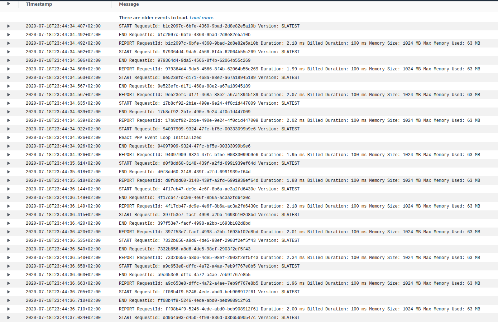

# React PHP AWS Lambda

> Proof of Concept of Running React PHP in aws lambda server

A proof of concept on how to run React-PHP on a serverless application at AWS Lambda service.
## Contributors

* [xserrat](https://github.com/xserrat)
* [kpicaza](https://github.com/kpicaza)

## System Requirements

* AWS Console with configured access
* Serverless Framework

## Goals

- [x] Execute an Async PRS-7 Request Handler from PSR-11 container
- [ ] Execute callable class from PSR-11 container
- [ ] Execute complete application like DriftPHP from a unique API Gateway entry-point

## Especial thanks

* [mnapoli](https://github.com/mnapoli) For making Bref, opening a new world of possibilities for PHP
* [mmoreram](https://github.com/mmoreram) For giving us he's perspective.

## Workaround

* Use Bref PHP-FPM 7.4 Layer
* We add a custom [bootstrap](https://github.com/kpicaza/react-php-lambda/blob/master/bootstrap) file using a React PHP event loop instead of the "while=true" loop given by default Bref bootstrap.
* The given handler is managed with promises by the [ReactHandler](https://github.com/kpicaza/react-php-lambda/blob/master/src/ReactHandler.php) class 
* We replace the [LambdaRuntime](https://github.com/brefphp/bref/blob/master/src/Runtime/LambdaRuntime.php) class by [ReactRuntime](https://github.com/kpicaza/react-php-lambda/blob/master/src/ReactRuntime.php) 

## Captures

Using Antidot Framework application's container, event dispatcher, and Request handler returning promises.
 
 
